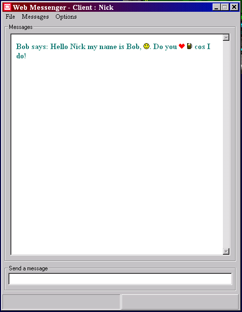



## Web Messenger 1\.1\.16

### Description

MSN Messenger clone, but programmed better!. This version has a few fixes, 1 of the fixes thanxs to The Frog Prince, thanks mate. It also has slightly more intuitive menus, it also contains an available icons menu which tells you what strings are replaced with pictures, for example (B) gets replaced with a Pint of beer. Plus sound events that allow you to apply wave files to actions. Please download and test and then rate it :) :)
 
### More Info
 

             |
---                |---
**Submitted On**   |2001-02-13 11:24:10
**By**             |[Niknak\!\! \<OLD\>](https://github.com/Planet-Source-Code/PSCIndex/blob/master/ByAuthor/niknak-old.md)
**Level**          |Advanced
**User Rating**    |4.5 (27 globes from 6 users)
**Compatibility**  |VB 6\.0
**Category**       |[Miscellaneous](https://github.com/Planet-Source-Code/PSCIndex/blob/master/ByCategory/miscellaneous__1-1.md)
**World**          |[Visual Basic](https://github.com/Planet-Source-Code/PSCIndex/blob/master/ByWorld/visual-basic.md)
**Archive File**   |[CODE\_UPLOAD148912132001\.zip](https://github.com/Planet-Source-Code/niknak-old-web-messenger-1-1-16__1-20966/archive/master.zip)

